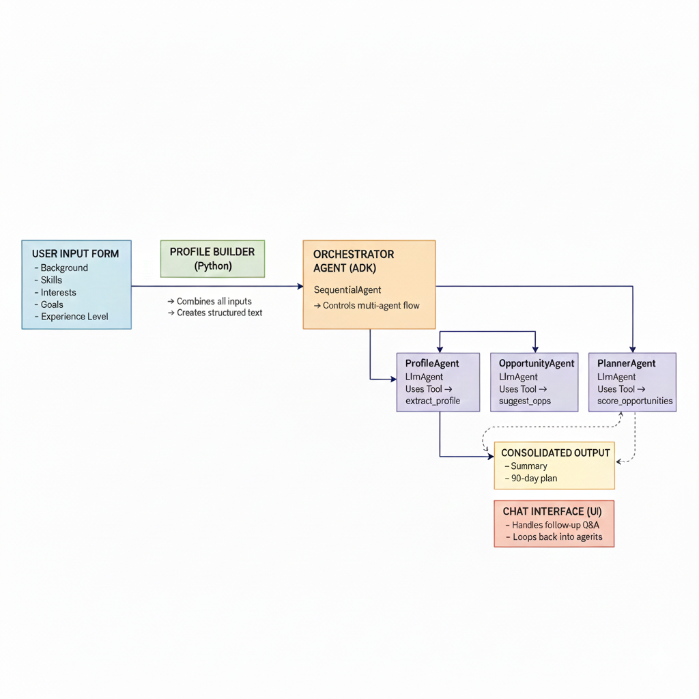

# AI Opportunity Navigator — Capstone Project

A multi-agent career-guidance system built using Google ADK, Gemini, and Gradio.  
It analyzes a user’s background, skills, interests, experience level, and goals — then generates personalized research roles, internships, projects, and a structured 60–90 day action plan.

---

## 🧭 Overview

Choosing the right career opportunity is difficult — too many choices, not enough clarity.  
This project solves the problem using an **agentic AI system** that coordinates multiple agents to guide the user.

The system includes the following components:

### 🧩 ProfileAgent  
Understands the user’s background and extracts structured information.

### 🎯 OpportunityAgent  
Recommends research roles, internships, and project ideas.

### 🗺 PlannerAgent  
Creates a personalized **60–90 day action plan** based on the user's goals and opportunities.

### 🧠 Orchestrator (SequentialAgent)  
Runs agents in sequence:

**Profile → Opportunity → Planner**

### 💬 Gradio UI  
Collects user details and provides a **chat interface** for follow-up questions.

---

## ✨ Features

- ✅ Multi-agent system powered by **Google ADK**
- ✅ Uses **Gemini 2.5 Flash / Flash Lite**
- ✅ Smart tools: `extract_profile`, `suggest_opps`, `score_opportunities`
- ✅ Clean and interactive **Gradio** UI
- ✅ Personalized opportunity matching based on background, skills, interests & goals
- ✅ Auto-generated **60–90 day action plan**
- ✅ Handles follow-up questions and adapts responses
- ✅ Future-ready: can be extended to show **live job links** (LinkedIn, Indeed, Google Jobs)

---

## ⚙️ How It Works

### 1️⃣ User Provides Background

Inputs include:

- Skills  
- Education  
- Goals  
- Interests  
- Experience level  

---

### 2️⃣ Profile Builder

Converts all user inputs into a **structured profile text** that agents can work with.

---

### 3️⃣ Orchestrator Agent

Runs the workflow in order:

**ProfileAgent → OpportunityAgent → PlannerAgent**

Each agent focuses on its own task, but they work together as a pipeline.

---

### 4️⃣ Agents Produce

- Summary of the user profile  
- Matched opportunities (research roles, internships, projects)  
- A complete **60–90 day career plan**

---

### 5️⃣ Chat Interface

The user can:

- Ask follow-up questions  
- Request alternative paths  
- Update goals or skills  
- Explore different career directions  

The agents adapt automatically based on new input.

---

## 🧱 Tech Stack

- **Google ADK** (Agent Development Kit)  
- **Gemini 2.5 Flash / Flash Lite**  
- **Gradio** (for the web UI)  
- **Python**  
- **FunctionTool**, **SequentialAgent**, **LlmAgent**

---

## 🏗 Architecture Diagram

