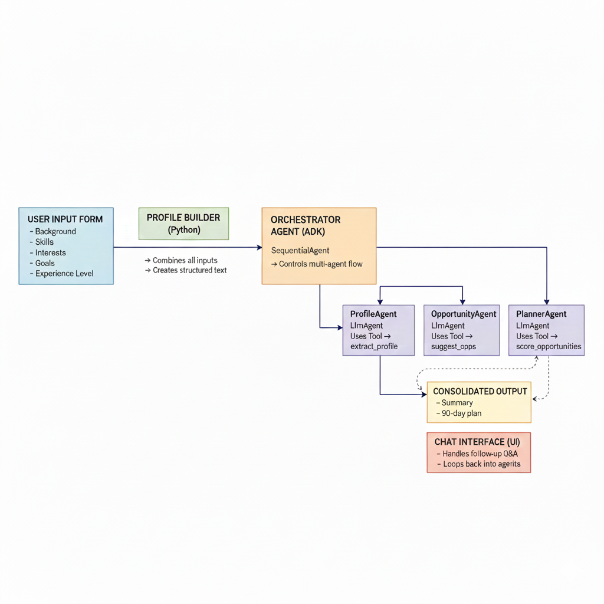

# AI Opportunity Navigator

## Personalized Career Guidance Using Multi-Agent AI Systems

[](https://www.kaggle.com/certification/badges/rishindramatechti/105)

AI Opportunity Navigator was developed as the capstone project for the **Google × Kaggle AI Agents Intensive**, a 5-day hands-on program focused on building agentic AI systems using Google's latest AI tooling.

The project explores how multi-agent architectures can transform a user's educational background, skills, interests, and career goals into actionable opportunities, personalized recommendations, and structured learning plans.

---

# The Problem

Students and early-career professionals often struggle to answer practical questions about their career path:

- Which opportunities align with my current skills?
- What projects should I build next?
- Which certifications are actually valuable?
- How do I move from my current position to my target role?

Most platforms provide generic suggestions or overwhelming lists of opportunities without explaining why they are relevant.

I wanted to build a system that behaves more like a mentor than a search engine.

---

# My Solution

AI Opportunity Navigator uses a multi-agent architecture where specialized agents collaborate to generate personalized career guidance.

The system analyzes a user's profile, identifies relevant opportunities, and creates a structured roadmap designed around their goals and current skill level.

Instead of generating generic outputs, every recommendation is tailored using information provided by the user.

---

# System Architecture

The platform consists of three specialized agents:

### Profile Agent
Extracts and structures information about a user's education, skills, interests, experience, and goals.

### Opportunity Agent
Identifies relevant internships, research opportunities, certifications, and project ideas aligned with the user's profile.

### Planner Agent
Generates a personalized 60–90 day action plan focused on closing skill gaps and achieving career objectives.

### Workflow

```text
Profile Agent
      ↓
Opportunity Agent
      ↓
Planner Agent
```

The agents are orchestrated using Google's Agent Development Kit (ADK), allowing context to flow across each stage of the workflow.

---

# Key Features

- Multi-agent architecture powered by Google ADK
- Gemini-based reasoning and decision generation
- Personalized internship and research recommendations
- Project and certification suggestions
- Automated 60–90 day learning roadmap generation
- Interactive Gradio web interface
- Follow-up question support through conversational interactions
- Modular architecture for future agent expansion

---

# Technologies Used

| Category | Technologies |
|-----------|-------------|
| AI Framework | Google ADK |
| LLM | Gemini 2.5 Flash |
| Backend | Python |
| UI | Gradio |
| Agent Architecture | SequentialAgent |
| Tools | FunctionTool |
| Development Platform | Kaggle Notebooks |

---

# How To Run

### Clone the repository

```bash
git clone https://github.com/rishindra-mateti-tech/ai-opportunity-navigator-capstone-project.git
cd ai-opportunity-navigator-capstone-project
```

### Configure API Access

Create a Google API key and set:

```bash
GOOGLE_API_KEY=your_api_key
```

### Launch the Notebook

Open:

```text
ai-opportunity-navigator-capstone-project.ipynb
```

using:

- Kaggle Notebooks
- Google Colab
- Jupyter Notebook

### Run All Cells

The notebook will:

- Initialize Google ADK
- Configure Gemini
- Build the agent workflow
- Launch the Gradio interface

---

# What I Learned

This project was my first deep dive into agentic AI systems.

Building AI Opportunity Navigator helped me better understand:

- Multi-agent orchestration patterns
- Context sharing across agents
- Tool-calling workflows
- Agent specialization strategies
- Sequential reasoning pipelines
- Human-in-the-loop AI interactions

More importantly, it demonstrated how decomposing a complex problem into specialized agents can improve reliability, maintainability, and overall system performance.

---

# Future Improvements

Planned enhancements include:

- Live job aggregation from external platforms
- Resume analysis and optimization
- PDF export of career roadmaps
- Opportunity ranking using market-demand data
- User profile persistence
- Agent-to-Agent (A2A) communication
- Long-term memory and progress tracking

---

# Architecture Diagram



---

# Demo Video

[](https://youtu.be/dUHtmetdXHY)

---

# Author

**Rishindra Mateti**

MS in Computer Science  
Wright State University

Interests:
Artificial Intelligence • Machine Learning • Agentic Systems • Cloud Computing • Intelligent Automation
